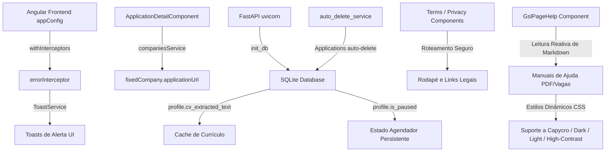

# 📝 Registro de Desenvolvimento — 02/06/2026

**Escopo:** Robustez e Otimização do Agendador, Caching de Arquivos, Limpeza, Tratamento HTTP Global, Páginas Legais, Documentação e Acessibilidade Visual Reativa.
**Commits gerados:** 10
**Arquivos modificados:** 73

---

## 1. Visão Geral das Alterações

> Desenvolvemos uma rodada abrangente de melhorias operacionais, acessibilidade, segurança e performance no JobHunter. Centralizamos o tratamento de erros HTTP no frontend via interceptor reativo e otimizamos a CPU do backend com caching inteligente de extração de PDF no SQLite. Além disso, reestruturamos as páginas legais (Termos de Uso e Política de Privacidade) com linguagem 100% amigável livre de jargões técnicos para usuários leigos, tornamos o renderizador de manuais Markdown dinâmico e responsivo a temas, adicionamos documentações ilustrativas completas de automação e refinamos interações visuais.

---

## 2. Arquitetura Afetada

Diagrama Mermaid mostrando os componentes/serviços modificados e suas relações:

---

## 3. Mapa de Arquivos Modificados (Principais Alterações)

| Arquivo | Tipo | O que mudou |
|--------|------|-------------|
| `application-detail.component.ts` | Component | Corrige chamadas 404 em vagas fictícias de envio recorrente, restabelece link dinâmico de candidatura de empresas fixas e sanitiza caminhos de screenshots. |
| `error.interceptor.ts` | Service Interceptor | Captura globalmente falhas HTTP no Angular e emite toasts correspondentes com a mensagem do backend. |
| `app.config.ts` | Angular Config | Registra o novo `errorInterceptor` na configuração de injeção global de HttpClient. |
| `database.py` | Database Core | Implementa atualização silenciosa de colunas SQLite ('self-healing') na inicialização do servidor. |
| `profile.py` | API Router / Models | Adiciona colunas e faz caching de texto extraído do PDF do currículo durante upload, reduzindo leituras recorrentes de disco. |
| `scheduler_service.py` | Service | Persiste estados `is_paused` e `paused_until` de forma assíncrona no SQLite. |
| `auto_delete_service.py` | Service | Adiciona deleção de candidaturas com mais de N dias arquivadas na rotina diária de limpeza. |
| `privacy.component.ts` | Component | Reescreve completamente a explicação de verificação de arquivos e caching de currículos com terminologia amigável a usuários leigos. |
| `gsl-page-help.component.ts` | Component | Adapta o gerador dinâmico de manuais Markdown para responder a variáveis CSS dos quatro temas e elimina avisos de tipagem estrita (`any`). |
| `companies.component.ts` | Component | Reduz jargões de status internos nos logs e torna as listagens integradas a animações visuais. |
| `jobs-list.component.ts` | Component | Otimiza os estados de polling de automações e suaviza transições de foco. |
| `vagas.md` | Document | Novo guia e manual de usuário para automação de candidaturas robóticas a vagas dinâmicas. |
| `empresas-fixas.md` | Document | Simplifica as orientações do manual de empresas fixas com ênfase no anexo de currículo em PDF. |

---

## 4. Detalhamento por Commit

### `fix(applications): corrige carregamento de vaga, screenshots e link corporativo em candidaturas recorrentes`

**Razão da alteração:**
> Evitar erros HTTP 404 ao ler `/jobs/recurring` em candidaturas a empresas fixas e restaurar o botão de visualização que havia sumido.

**O que faz agora:**
> Ignora a busca por vaga local fictícia se a candidatura for do tipo recorrente, busca os metadados da empresa fixa via `companiesService` e exibe o botão "Ver link de envio" apontando com segurança para a URL de candidatura da empresa.

**Decisões técnicas:**
> Centralizou a resolução de caminhos locais de screenshots gerando caminhos relativos HTTP seguros em conformidade com o local de montagem do servidor (`/screenshots`).

**Arquivos envolvidos:**
- `frontend/src/app/features/applications/application-detail/application-detail.component.ts` — Ajusta carregamento e template.
- `backend/app/api/routes/applications.py` — Adiciona o título `"Candidatura Recorrente"` às candidaturas sem vagas associadas.

---

### `feat(interceptor): implementa interceptor funcional global de erros HTTP`

**Razão da alteração:**
> Eliminar a duplicação de lógica de tratamento de erros HTTP por toda a aplicação Angular.

**O que faz agora:**
> Captura erros globais de rede e erros de status retornado pelo servidor, extraindo o campo `detail` e notificando visualmente o usuário através do `ToastService`.

**Decisões técnicas:**
> Utilizou a API moderna de interceptores funcionais (`HttpInterceptorFn`) introduzida nas versões recentes do Angular para máxima leveza.

**Arquivos envolvidos:**
- `frontend/src/app/core/interceptors/error.interceptor.ts` — Criação do interceptor.
- `frontend/src/app/app.config.ts` — Registro no bootstrap da aplicação.

---

### `feat(scheduler): persiste e carrega o estado ativo/pausado do agendador no banco de dados`

**Razão da alteração:**
> Evitar que reinicializações do servidor redefinam a preferência de pausa do agendador configurada pelo usuário.

**O que faz agora:**
> Grava os estados `is_paused` e `paused_until` na tabela `candidate_profiles` do banco SQLite de forma assíncrona.

**Decisões técnicas:**
> Escreveu uma migração automática baseada em `PRAGMA table_info` no FastAPI startup para que as colunas adicionadas sejam criadas sem intervenção humana no SQLite de dev.

**Arquivos envolvidos:**
- `backend/app/models/profile.py` — Novos campos no modelo.
- `backend/app/services/scheduler_service.py` — Lógica de salvamento assíncrono.
- `backend/app/api/routes/scheduler.py` — Await nos endpoints de controle.
- `backend/app/core/database.py` — Automação 'self-healing' de tabelas.

---

### `feat(auto-delete): implementa limpeza automática de candidaturas arquivadas`

**Razão da alteração:**
> Estender a regra de expiração de vagas legadas (30 dias) para candidaturas arquivadas obsoletas.

**O que faz agora:**
> Exclui candidaturas arquivadas cuja atualização de status no banco tenha mais tempo que o valor configurado em `auto_delete_days`.

**Arquivos envolvidos:**
- `backend/app/services/auto_delete_service.py` — Rotinas de verificação e limpeza no banco.

---

### `docs(manual): atualiza manual de empresas fixas e adiciona guia de automacao de vagas`

**Razão da alteração:**
> Munir os usuários de documentação simples passo a passo para o preenchimento de currículos em vagas e empresas parceiras.

**O que faz agora:**
> Apresenta fluxos visuais detalhados explicando como configurar o perfil, o que o robô faz por trás das telas e como interpretar logs sem requerer conhecimento técnico.

**Arquivos envolvidos:**
- `frontend/public/docs/manuais-usuario/vagas.md` — Criação do manual completo de vagas.
- `frontend/public/docs/manuais-usuario/empresas-fixas.md` — Edição simplificadora.

---

### `fix(privacy): humaniza termos tecnicos da politica de privacidade para usuario leigo`

**Razão da alteração:**
> Cumprir o requisito de transparência total da LGPD, removendo jargões técnicos incompreensíveis ao usuário leigo.

**O que faz agora:**
> Substitui conceitos complexos (como *magic bytes check*, *backend*, *database variables*, *Playwright* e *APIs*) por descrições conceituais claras de "verificação digital automática de segurança", "memória de acesso rápido" e "simulação de navegação humana".

**Arquivos envolvidos:**
- `frontend/src/app/features/privacy/privacy.component.ts` — Revisão completa de texto e tags de fechamento.

---

### `refactor(help): torna o renderizador de ajuda reativo a temas e resolve avisos do compilador`

**Razão da alteração:**
> Garantir perfeita legibilidade e acessibilidade visual dos manuais de ajuda em todos os temas de cores (incluindo Capycro e Alto Contraste) e resolver avisos de compilação restrita TypeScript.

**O que faz agora:**
> Vincula cores de títulos, códigos inline, caixas de alerta (`> [!NOTE]`, `> [!TIP]`, etc.) e bordas às variáveis CSS reativas do tema ativo e tipa explicitamente parâmetros de arrays no compilador do Angular.

**Arquivos envolvidos:**
- `frontend/src/app/shared/components/gsl-page-help/gsl-page-help.component.ts` — Lógica do renderizador nativo Markdown.

---

### `style(ui): melhora consistencia de hovers e reduz jargoes tecnicos nas listas`

**Razão da alteração:**
> Manter a consistência estética do design e ocultar termos internos das filas de processamento.

**O que faz agora:**
> Adiciona o utilitário `.hover-text-primary` de forma responsiva ao seletor de vagas e empresas, refinando transições suaves nas tabelas.

**Arquivos envolvidos:**
- `frontend/src/app/features/companies/companies.component.ts`
- `frontend/src/app/features/jobs/jobs-list/jobs-list.component.ts`

---

## 5. ✅ O Que Está Funcionando
- Carregamento de detalhes de candidaturas recorrentes sem erro de 404 ou avisos de segurança de screenshots.
- Exibição de link real de candidatura para empresas fixas sob candidaturas recorrentes.
- Persistência inabalável de estado do scheduler em SQLite após reiniciar o backend.
- Notificações de toast global em erros de comunicação com o servidor.
- Limpeza e auto-delete de vagas e candidaturas obsoletas.
- Renderização rica e responsiva de manuais de usuário no drawer flutuante nativo em conformidade total com Dark, Light, Capycro e High-Contrast.
- Textos legais amigáveis e em conformidade estrita com a LGPD.

---

## 6. ❌ O Que Está Funcionando de Forma Pendente
- `[ ]` Sincronização automatizada com Supabase/PostgreSQL em produção — *aguardando execução da Fase 1 do novo Plano de Ação.*

---

## 7. ⚠️ Dívida Técnica Identificada
- Alguns componentes legados de frontend contêm inscrições puras do RxJS sem acoplamento automático ou operadores `takeUntilDestroyed()`, o que pode ser refatorado no futuro.

---

## 8. Padrões Importantes a Lembrar
- Sempre registrar interceptores na raiz `app.config.ts`.
- Mantenha queries raw SQLite envolvidas com a função `sqlalchemy.text()` para garantir execução compatível.
- Utilizar a classe `.hover-text-primary` para manter os hovers responsivos ao tema ativo.

---

## 9. Próximos Passos
1. Configuração do Supabase PostgreSQL na nuvem (Fase 1 do Plano de Ação).
2. Integração do Firebase Auth JWT no FastAPI e Angular Guards.

---

## 10. Validações Mapeadas

| Campo / Função | Regra de validação | Status |
|---------------|-------------------|--------|
| Upload de CV | Máximo 10 MB, formato PDF (assinatura verificada) | ✅ |
| Segurança de URL | Padrão strict de protocolos web e pasta /screenshots | ✅ |
| Scheduler Pause | Carregamento reativo no startup da API | ✅ |
| Acessibilidade Visual | Contraste e cores adaptados reativamente por tema | ✅ |
