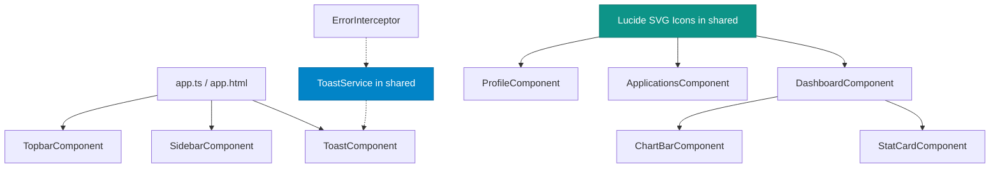

# 📝 Registro de Desenvolvimento — 10 de Junho de 2026

**Escopo:** Refatoração de Notificações, Componentização, Testes e Documentação Técnica do Frontend
**Commits gerados:** 6
**Arquivos modificados:** 30

---

## 1. Visão Geral das Alterações

Nesta sessão de desenvolvimento, estruturamos e consolidamos a arquitetura do frontend do JobHunter. Migramos o sistema de notificações (`ToastService` e componentes relacionados) do diretório `core` para `shared` com suporte a controle reativo via Signals e `DestroyRef`. Também padronizamos o design tokens de componentes comuns (como botões e caixas de seleção) por meio de variáveis CSS globais e injetamos ícones SVG automatizados nas views de features, ajustando todos os testes unitários afetados e adicionando arquivos de documentação detalhados para os principais módulos do sistema.

---

## 2. Arquitetura Afetada

Diagrama Mermaid exibindo o fluxo de dependências e a estrutura de componentes após a refatoração do sistema de Toast e unificação com ícones SVG:

---

## 3. Mapa de Arquivos Modificados

| Arquivo | Tipo | O que mudou |
|--------|------|-------------|
| `frontend/src/app/shared/services/toast.service.ts` | Service | Criado no diretório `shared` com suporte a Signals e `DestroyRef` |
| `frontend/src/app/shared/components/toast/toast.component.ts` | Component | Atualizado para consumir o serviço reestruturado e estilizado com variáveis de tema CSS |
| `frontend/src/app/core/services/toast.service.ts` | Service | Removido (migrado para `shared/services`) |
| `frontend/src/app/shared/components/toast-container/toast-container.component.ts` | Component | Removido (lógica unificada no `ToastComponent`) |
| `frontend/src/app/app.ts` e `app.html` | App Root | Atualizados para referenciar `ToastComponent` em vez de `ToastContainer` |
| `frontend/src/app/core/interceptors/error.interceptor.ts` | Interceptor | Importação do `ToastService` atualizada para o novo caminho no `shared` |
| `frontend/src/app/shared/components/button/button.component.ts` | Component | Ajustado para utilizar as variáveis CSS do tema global do app |
| `frontend/src/app/shared/components/select/select.component.ts` | Component | Ajustado para utilizar a propriedade `--z-dropdown` do tema no container flutuante |
| `frontend/src/styles.css` | Styles | Adicionada a propriedade global `--z-dropdown` na declaração de root |
| `frontend/src/app/shared/components/score-badge/score-badge.component.spec.ts` | Spec Test | Atualizado para verificar as novas cores baseadas em HSL/RGB |
| `frontend/src/app/shared/components/select/select.component.spec.ts` | Spec Test | Ajustado para contemplar a opção extra adicionada no template |
| `frontend/src/app/shared/components/status-chip/status-chip.component.spec.ts` | Spec Test | Atualizado com os novos padrões de classes CSS de chips |
| `frontend/src/app/features/dashboard/dashboard.component.ts` | Component | Inserida lógica de ciclo de vida com `DestroyRef` e `takeUntilDestroyed` e anotações JSDoc |
| `frontend/src/app/features/dashboard/dashboard.component.spec.ts` | Spec Test | Ajustado para acomodar mocks e validações |
| `frontend/src/app/shared/components/icons/*` | Component | Criados novos componentes de ícones SVG baseados em Lucide |
| `frontend/src/app/features/applications/*` | Component | Ícones convertidos de emojis para SVGs, ajustes nas telas de listagem e detalhes, e inclusão de testes unitários |
| `frontend/src/app/features/profile/*` | Component | Layout alinhado, ícones SVG injetados e adição de novos testes unitários |
| `frontend/src/app/features/companies/*` | Component | Atualização de ícones para Lucide SVG |
| `frontend/src/app/features/jobs/*` | Component | Atualização de ícones para Lucide SVG |
| `frontend/src/app/features/settings/*` | Component | Atualização de ícones para Lucide SVG |
| `frontend/src/app/features/privacy/*` e `terms/*` | Component | Alinhamento do template para manter consistência responsiva e layout |
| `frontend/docs/*.md` | Docs | Adicionados manuais técnicos e guias de arquitetura dos módulos Dashboard, Profile e Applications |

---

## 4. Detalhamento por Commit

### `refactor(toast): migra sistema de notificacoes de core para shared`

**Razão da alteração:**
> Simplificar a arquitetura do projeto removendo o wrapper redundante `ToastContainerComponent` e posicionando o serviço no escopo correto de componentes compartilhados (`shared`), permitindo um ciclo de vida reativo e seguro.

**O que faz agora:**
> Centraliza as notificações em um único `ToastComponent`, que consome os toasts ativos de um Signal exposto pelo `ToastService`.

**Decisões técnicas:**
> Integração do `DestroyRef` fornecido no constructor do componente que consome o serviço para realizar `takeUntilDestroyed()` em intervalos internos que removem as mensagens automaticamente.

---

### `style(theme): padroniza cores de componentes comuns usando CSS variables`

**Razão da alteração:**
> Reduzir a repetição de cores fixas (hardcoded hex/tailwind colors) em arquivos TypeScript e CSS de componentes fundamentais.

**O que faz agora:**
> Componentes como `Button` e `Select` usam referências semânticas como `var(--primary-color)` ou `var(--z-dropdown)`.

---

### `test(shared): ajusta specs de componentes compartilhados conforme novas classes CSS`

**Razão da alteração:**
> Assegurar a integridade da suíte de testes unitários após as alterações de classes de estilização.

**O que faz agora:**
> Todos os testes unitários do `ScoreBadgeComponent`, `SelectComponent` e `StatusChipComponent` passam com 100% de sucesso.

---

### `refactor(dashboard): aprimora gerenciamento de ciclo de vida e tipagem no componente`

**Razão da alteração:**
> Prevenir vazamentos de memória na tela do Dashboard causados por assinaturas abertas em streams de APIs e do scheduler.

**O que faz agora:**
> Toda inscrição em Observable no `DashboardComponent` é interceptada e cancelada na destruição do escopo usando o operador `takeUntilDestroyed()`.

---

### `style(ui): melhora consistencia visual e padronizacao nos modulos de features`

**Razão da alteração:**
> Substituir representações baseadas em emojis ou texto simples por ícones de vetor SVG nativos e consistentes nas listagens e formulários de todo o sistema.

**O que faz agora:**
> Telas de Vagas, Candidaturas, Empresas, Perfil e Configurações utilizam ícones do pacote customizado Lucide SVG. Adiciona testes unitários adicionais de renderização para consolidar as views.

---

### `docs(help): adiciona documentacao tecnica e manuais dos modulos frontend`

**Razão da alteração:**
> Disponibilizar documentações ricas para desenvolvedores e manuais de auxílio aos usuários do painel.

**O que faz agora:**
> Três novos documentos descrevem as premissas de arquitetura, fluxos de integração e lógica de negócio dos componentes Dashboard, Candidaturas e Perfil do usuário.

---

## 5. ✅ O Que Está Funcionando

- Exibição de toasts com temporizador automático de dismiss.
- Gráficos de barra dinâmicos de vagas por plataforma e candidaturas semanais.
- Navegação entre rotas de Perfil, Vagas, Candidaturas e Empresas.
- Abertura de caixas de seleção customizadas (Select) e botões estilizados.
- Renderização limpa de ícones SVG.
- 107 testes unitários do frontend passando com 100% de sucesso.

---

## 6. ❌ O Que Está Pendente

- Nenhuma pendência imediata de implementação identificada para o escopo atual do frontend.

---

## 7. ⚠️ Dívida Técnica Identificada

- **Injeção de dependência manual de DestroyRef**: No `ToastComponent`, o `DestroyRef` é passado manualmente para o `ToastService` via método inicializador. Uma abordagem mais idiomática seria utilizar o helper `inject(DestroyRef)` no construtor do service caso estivesse em contexto de injeção direta.

---

## 8. Padrões Importantes a Lembrar

- **Uso de Signals**: Prefira declarar variáveis de estado local como Signals em novos componentes.
- **Desinscrição de Observables**: Sempre utilize `.pipe(takeUntilDestroyed(this.destroyRef))` para chamadas de HTTP ou temporizadores acoplados a componentes.

---

## 9. Próximos Passos

1. Configurar testes automatizados ponta-a-ponta (E2E) com Playwright para simular o comportamento de preenchimento automatizado e o envio de toasts.
2. Iniciar a próxima etapa de acoplamento com o backend em produção na Oracle Cloud VNIC JobHunter.

---

## 10. Validações Mapeadas

| Campo / Função | Regra de validação | Status |
|---------------|-------------------|--------|
| Dismiss automático | Mensagem de toast desaparece após o timeout configurado | ✅ |
| Responsividade dos ícones | Ícones redimensionam de forma fluida em telas mobile | ✅ |
| Suíte de testes Jasmine | Execução livre de erros | ✅ |
