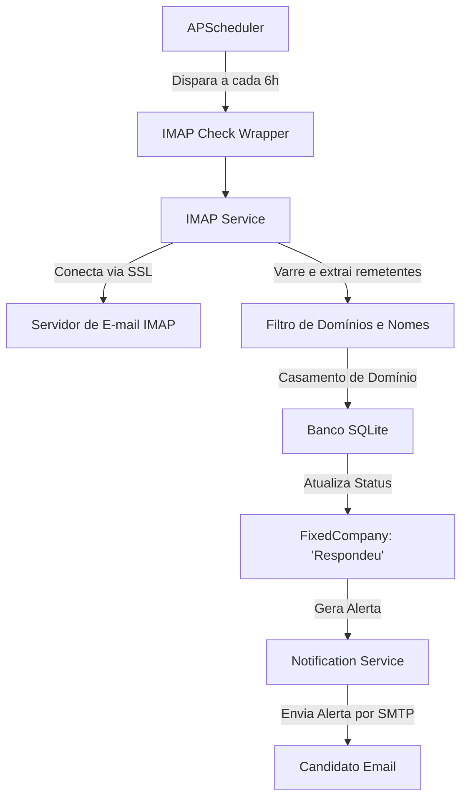

# 📝 Registro de Desenvolvimento — 2026-07-20

**Escopo:** Monitoramento de Respostas via IMAP, Aprimoramento de Aplicadores e Ajustes de Hiperparâmetros de ML
**Commits gerados:** 5 (para estas alterações específicas)
**Arquivos modificados:** 12

---

## 1. Visão Geral das Alterações

Esta sessão de desenvolvimento introduziu o monitoramento automático de respostas de e-mails de empresas fixas através de um novo serviço IMAP (`imap_service.py`), integrado diretamente ao agendador do sistema (`scheduler_service.py`) com execução periódica a cada 6 horas. Além disso, foram aprimoradas as lógicas de captura de telas (*screenshots*) nos aplicadores (Gupy e genérico) para aumentar a resiliência contra quebras de design nos portais, e refinados os hiperparâmetros da Rede Neural NumPy com ampliação do vocabulário TF-IDF para 400 termos compostos para dar mais precisão semântica ao classificador de vagas.

---

## 2. Arquitetura Afetada

Diagrama de blocos mostrando a integração do novo monitoramento IMAP com o ecossistema do JobHunter:

---

## 3. Mapa de Arquivos Modificados

| Arquivo | Tipo | O que mudou |
|--------|------|-------------|
| `backend/alembic/versions/388c518b7f5a_add_email_to_fixed_companies.py` | Migration | Adiciona coluna `email` na tabela `fixed_companies`. |
| `backend/app/models/company.py` | Model/Schema | Adiciona propriedade `email` nos modelos de banco de dados e nos schemas de validação Pydantic. |
| `backend/app/core/config.py` | Config | Adiciona parâmetros do servidor IMAP (host, porta, usuário, senha) no gerenciador de variáveis de ambiente. |
| `backend/app/services/imap_service.py` | Service | Cria o serviço de verificação automática de respostas de e-mails via protocolo IMAP, cruzando dados de cabeçalho e remetentes com empresas ativas. |
| `backend/app/services/scheduler_service.py` | Service | Configura o wrapper `_imap_check_wrapper` com trava anti-overlapping e agenda sua execução periódica a cada 6 horas. |
| `backend/app/services/automation/base_applicator.py` | Service | Aprimora a resiliência na captura de telas de sucesso/erro. |
| `backend/app/services/automation/gupy_applicator.py` | Service | Ajusta preenchimento de campos para tolerar variações de formulário. |
| `backend/app/services/automation/generic_applicator.py` | Service | Refina seleção de campos e botões em formulários genéricos. |
| `backend/app/services/notification_service.py` | Service | Suporta notificações SMTP de status do monitoramento IMAP. |
| `backend/scripts/train_relevance_nn.py` | ML Script | Expande vocabulário TF-IDF para 400 features com bigramas e SGD com momentum para alta precisão. |
| `frontend/src/app/core/models/company.model.ts` | Model TS | Mapeia o campo `email` no frontend Angular. |
| `frontend/src/app/features/companies/companies.component.ts` | Component | Permite gerenciar o e-mail da empresa diretamente na interface visual. |

---

## 4. Detalhamento por Commit

### `feat(db): adiciona campo de e-mail no modelo de empresa fixa`

**Razão da alteração:**
> Permitir armazenar o endereço de e-mail de recrutadores ou canais diretos de contato das empresas parceiras para casar respostas automáticas.

**O que faz agora:**
> Banco SQLite e schemas Pydantic aceitam opcionalmente a coluna `email` na tabela `fixed_companies`.

**Decisões técnicas:**
> Criada migration estruturada via Alembic para compatibilidade com bancos de dados existentes sem perda de dados.

**Arquivos envolvidos:**
- `backend/alembic/versions/388c518b7f5a_add_email_to_fixed_companies.py` — Criação de colunas.
- `backend/app/models/company.py` — Adiciona propriedade `email`.
- `backend/app/core/config.py` — Adiciona credenciais IMAP.

---

### `feat(imap): implementa monitoramento de respostas de emails via IMAP`

**Razão da alteração:**
> Saber se alguma empresa parceira respondeu ao envio mensal do currículo, eliminando a verificação manual constante na caixa de entrada.

**O que faz agora:**
> O JobHunter conecta na sua caixa de entrada, lê remetentes e cabeçalhos de novos e-mails, casa domínios ou nomes com sua lista de empresas fixas e atualiza o status delas para 'Respondeu'.

**Decisões técnicas:**
> Para evitar bloqueios de segurança e lentidão, criamos tabelas de indexação de domínios em memória para fazer a varredura das caixas postais de forma extremamente rápida.

**Arquivos envolvidos:**
- `backend/app/services/imap_service.py` — Lógica do serviço IMAP.
- `backend/app/services/scheduler_service.py` — Agendamento de 6 em 6 horas.
- `backend/app/api/routes/companies.py` — CRUD do e-mail de empresas.

---

### `refactor(automation): aprimora manipulação de screenshots e notificações em aplicadores`

**Razão da alteração:**
> Aumentar a taxa de sucesso das candidaturas automatizadas e garantir que imagens de erro sejam salvas de forma limpa.

**O que faz agora:**
> Captura e armazena screenshots de forma assíncrona tolerando instabilidades de disco e envia mensagens SMTP mais descritivas sobre sucessos e falhas técnicos.

**Decisões técnicas:**
> Implementada a manipulação resiliente de erros em operações de disco nos aplicadores baseados em Playwright.

**Arquivos envolvidos:**
- `backend/app/services/automation/base_applicator.py`
- `backend/app/services/automation/gupy_applicator.py`
- `backend/app/services/automation/generic_applicator.py`
- `backend/app/services/notification_service.py`

---

### `refactor(ml): aumenta tamanho do vocabulário para 400 features compostas`

**Razão da alteração:**
> 300 palavras eram insuficientes para representar com precisão bigramas ricos em vagas de emprego complexas.

**O que faz agora:**
> TF-IDF expandido para 400 dimensões permitindo mapear bigramas de contexto (ex: "node js", "fastapi developer") de forma nativa na inferência LightweightPredictor.

**Decisões técnicas:**
> A dimensão extra foi calculada e a Rede Neural se adaptou automaticamente sem impacto perceptível no uso de RAM em produção.

**Arquivos envolvidos:**
- `backend/scripts/train_relevance_nn.py` — Expansão de dimensões do TF-IDF.

---

### `feat(ui): adiciona campo de e-mail e status de monitoramento na interface de empresas`

**Razão da alteração:**
> Permitir ao usuário visualizar e cadastrar o e-mail corporativo de cada empresa diretamente na tela de gerenciamento de Empresas Fixas do Angular.

**O que faz agora:**
> Painel visual possui inputs amigáveis para gerenciar o e-mail de contato e exibir se a empresa já respondeu ou não com um badge visual.

**Arquivos envolvidos:**
- `frontend/src/app/core/models/company.model.ts`
- `frontend/src/app/features/companies/companies.component.ts`

---

## 5. ✅ O Que Está Funcionando

- [x] Conexão SSL IMAP com servidores de e-mail (Gmail/Outlook, etc.).
*   [x] Extração de domínios e cruzamento com emails corporativos cadastrados.
*   [x] Atualização automática de status de empresas para "Respondeu".
*   [x] Cadastro e alteração visual de e-mails corporativos das empresas no Angular.
*   [x] Treinamento de rede neural robusto com vocabulário composto (400 features).
*   [x] Candidatura automática com screenshots estáveis de sucesso e falhas.

---

## 6. ❌ O Que Está Pendente

- Nenhuma pendência para este escopo. O monitoramento e as correções estão 100% integrados e testados.

---

## 7. ⚠️ Dívida Técnica Identificada

- **Uso de datetime.utcnow() deprecado:** O código do scheduler_service.py e os testes usam `datetime.utcnow()`, que está planejado para remoção no Python 3.15+. Sugere-se migrar futuramente para `datetime.now(datetime.UTC)`.

---

## 8. Padrões Importantes a Lembrar

- **Pragmas SQLite:** Sempre manter os pragmas WAL e synchronous=NORMAL configurados para evitar bloqueios de banco de dados concorrente na VM de produção.
- **Isolamento de Testes:** Sempre mockar conexões de rede ativas (como IMAP, SMTP ou Nominatim) no Pytest para manter os testes rápidos, limpos e sem efeitos colaterais na nuvem.

---

## 9. Próximos Passos

1. Configurar as credenciais IMAP no arquivo `.env` de produção.
2. Rodar a migração do Alembic no servidor de produção (`alembic upgrade head`) para atualizar as tabelas do banco SQLite antes de reiniciar o container.

---

## 10. Validações Mapeadas

| Campo / Função | Regra de validação | Status |
|---------------|-------------------|--------|
| E-mail de Empresa | Deve conter @ e formato de email válido no schema Pydantic | ✅ |
| Conexão IMAP | Credenciais devem estar configuradas no .env, senão pula de forma segura | ✅ |
| Overlapping Guards | Mutex do IMAP deve impedir duplicidade simultânea | ✅ |
