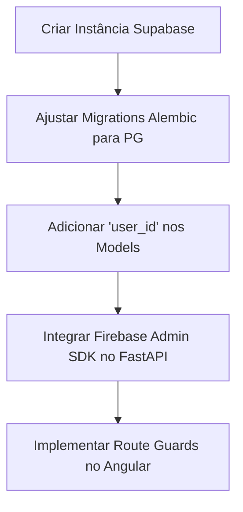

# Plano de Execução: Próximas Grandes Melhorias (Roadmap) 🗺️

Este plano de execução define um caminho estruturado, faseado e acionável para implementar as funcionalidades pendentes e evoluções arquiteturais do **JobHunter**, saindo de uma ferramenta pessoal para uma plataforma robusta e inteligente de alta escala.

---

## 📅 Visão Geral das Fases de Evolução

```mermaid
gantt
    title Cronograma de Implementação das Evoluções
    dateFormat  YYYY-MM-DD
    section Infra & Segurança
    Fase 1: Autenticação & PostgreSQL :active, f1, 2026-06-03, 7d
    section Negócio B2B
    Fase 2: Sistema B2B & Busca Pública   : f2, after f1, 10d
    section Inteligência Artificial
    Fase 3: Matching & Cover Letters com IA : f3, after f2, 8d
    section Confiabilidade
    Fase 4: Anti-Detecção & Otimização Scrapers : f4, after f3, 5d
```

---

## 🛠️ Fase 1: Autenticação, Supabase & Multi-tenancy (Prioridade: CRÍTICA)

> [!IMPORTANT]
> A transição de ferramenta monopessoal para multi-usuário exige o isolamento completo dos dados.

### Objetivos
- Configurar banco de dados **PostgreSQL** hospedado (Supabase/Neon).
- Migrar os dados existentes do SQLite para o PostgreSQL.
- Implementar **Firebase Authentication** com JWT no backend.
- Proteger rotas no frontend Angular e adicionar suporte a `userId` para isolar registros.

### Plano de Ação Passo a Passo



1. **Step 1: Setup do Supabase & Migração de Drivers**
   - Instalar `asyncpg` no backend e trocar a string `DATABASE_URL` no `.env` para o PostgreSQL.
   - Atualizar migrations do Alembic para refletir tipos nativos de PostgreSQL (como UUIDs em vez de Strings).
2. **Step 2: Multi-tenancy nos Modelos**
   - Adicionar o campo `user_id: Mapped[str] = mapped_column(String(128), nullable=False)` nas tabelas `jobs`, `applications`, `fixed_companies` e `candidate_profiles`.
   - Ajustar as consultas SQLAlchemy para sempre filtrar por `user_id == current_user.id`.
3. **Step 3: Firebase Admin SDK no FastAPI**
   - Criar dependência `get_current_user` no FastAPI que lê o JWT do header `Authorization`, valida contra o Firebase Admin SDK e retorna o payload do usuário.
4. **Step 4: Autenticação no Angular**
   - Instalar `@angular/fire` e configurar login/cadastro com email e senha.
   - Criar `AuthInterceptor` no Angular para anexar automaticamente o Bearer Token em todas as chamadas de API.
   - Configurar `AuthGuard` nas rotas do painel interno.

---

## 💼 Fase 2: Plataforma B2B & Busca Pública de Vagas (Prioridade: ALTA)

### Objetivos
- Permitir que empresas criem contas e publiquem vagas internas nativas.
- Criar a página pública de vagas, indexável por motores de busca (SEO).

### Plano de Ação Passo a Passo
1. **Step 1: Contas Empresariais**
   - Criar a tabela `companies` ligada a um usuário do tipo "Empresa".
   - Criar formulário `/company/register` e `/company/profile` no Angular.
2. **Step 2: CRUD de Vagas Internas**
   - Endpoint `POST /company/jobs` para publicação de vagas.
   - Dashboard simples para a empresa ver candidatos que se inscreveram nas suas vagas e trocar status (ex: "Em Triagem", "Entrevista", "Rejeitado").
3. **Step 3: Portal Público de Busca**
   - Rota pública `/vagas` sem necessidade de login.
   - Filtros dinâmicos (Cidade, Remoto/Híbrido/Presencial, Stack).
   - Otimização de SEO (Meta tags dinâmicas no Angular SSR ou tags padrão atualizadas via `Meta` service).

---

## 🧠 Fase 3: Inteligência Artificial (Matching & Cartas de Apresentação) (Prioridade: MÉDIA)

> [!TIP]
> O uso de LLMs melhora exponencialmente a precisão do score, indo além de simples correspondências de palavras-chave.

### Objetivos
- Avaliar a compatibilidade da descrição da vaga com o currículo de forma semântica.
- Gerar cartas de apresentação personalizadas baseadas no perfil.

### Plano de Ação Passo a Passo
1. **Step 1: Integração com Gemini API / modelo local**
   - Configurar o SDK do Google GenAI no backend.
   - Enviar a descrição da vaga + o texto cached do currículo (`profile.cv_extracted_text`) em um prompt otimizado para extrair:
     - Score semântico (0 a 100).
     - Pontos fortes do candidato para a vaga.
     - Lacunas de habilidades encontradas.
2. **Step 2: Geração de Cover Letter**
   - Adicionar botão "Gerar Apresentação" na visualização da vaga.
   - O prompt solicita à IA uma carta curta, profissional e persuasiva conectando as experiências do currículo aos requisitos da vaga.
   - Permitir cópia para a área de transferência ou exportação rápida para PDF.

---

## 🛡️ Fase 4: Anti-Detecção & Resiliência de Scrapers (Prioridade: MÉDIA)

### Objetivos
- Reduzir bloqueios e detecções de bots durante o Playwright scraping do LinkedIn e Vagas.com.

### Plano de Ação Passo a Passo
1. **Step 1: Integração de Rotação de User-Agents**
   - Usar a biblioteca `fake-useragent` para mudar as assinaturas dos navegadores Playwright a cada execução.
2. **Step 2: Injeção de Evasão (Playwright Stealth)**
   - Configurar scripts de evasão de automação para mascarar assinaturas do WebDriver (`navigator.webdriver = false`).
3. **Step 3: Delays Humanizados Avançados**
   - Adicionar movimentos simulados e delays orgânicos entre transições de páginas nas automações.
