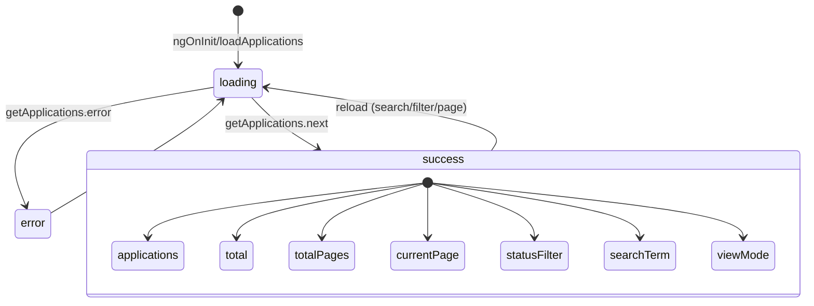
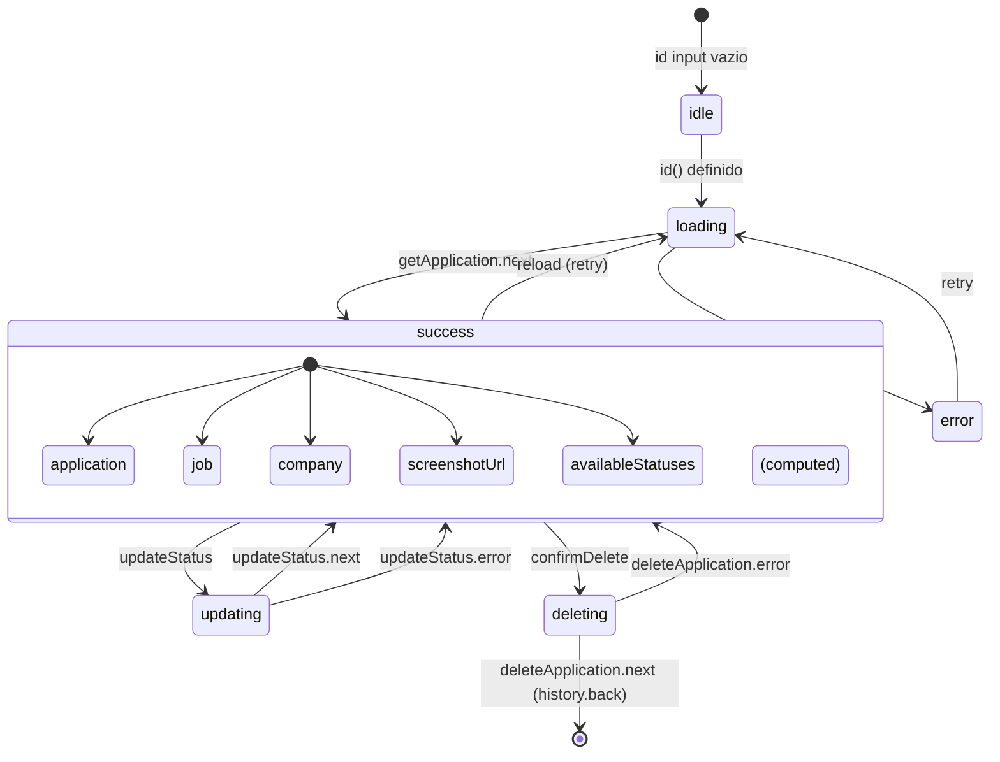

# Applications Module Documentation

## Visão Geral

O módulo **Applications** gerencia a listagem e o detalhe de candidaturas. Compreende dois componentes principais:

| Componente | Seletor | Rota | Descrição |
|------------|---------|------|-----------|
| `ApplicationsComponent` | `app-applications` | `/applications` | Listagem com busca, filtro, paginação, view list/grid |
| `ApplicationDetailComponent` | `app-application-detail` | `/applications/:id` | Detalhes completos, ações de status, screenshot, arquivamento |

Ambos são **standalone** e usam **Angular Signals** para reatividade fine-grained.

---

## Dependências

### Angular Core
- `@angular/core`: `Component`, `inject`, `OnInit`, `signal`, `computed`, `effect`, `input`, `DestroyRef`, `SecurityContext`, `takeUntilDestroyed`
- `@angular/common`: `DatePipe`
- `@angular/router`: `RouterLink`, `withComponentInputBinding()` (route param → input signal)
- `@angular/platform-browser`: `DomSanitizer`
- `@angular/forms`: `FormsModule` (apenas `ApplicationsComponent`)

### RxJS
- `Subject`, `debounceTime`, `distinctUntilChanged`, `pipe`
- `takeUntilDestroyed` (cleanup automático)

### Serviços (Core)
| Serviço | Responsabilidade |
|---------|------------------|
| `ApplicationsService` | CRUD candidaturas (`getApplications`, `getApplication`, `updateStatus`, `registerClick`, `deleteApplication`) |
| `JobsService` | Busca vaga associada (`getJob`) para URL externa |
| `CompaniesService` | Busca empresa fixa (`getCompanies`) para `applicationUrl` (recorrentes) |
| `ToastService` | Feedback visual unificado |

### Models
- `Application` + `ApplicationStatus` + `VALID_STATUS_TRANSITIONS` (core/models/application.model.ts)
- `Job` (core/models/job.model.ts)
- `FixedCompany` (core/models/company.model.ts)

### Componentes Compartilhados
| Componente | Uso |
|------------|-----|
| `SelectComponent` | Filtro de status (Applications) |
| `InputComponent` | Busca com ícone (Applications) |
| `StatusChipComponent` | Badge de status (ambos) |
| `RelativeTimePipe` | Formatação relativa (ambos) |
| `EmptyStateComponent` | Estado vazio (Applications) |
| `TriangleAlertIconComponent` | Ícone de erro (ambos) |
| `ChevronLeft/RightIconComponent` | Paginação (Applications) |
| `ClockIconComponent` | Timestamps (Detail) |
| `GslPageHelp` | Botão ajuda contextual (Applications) |

---

## Architecture & Data Flow

### ApplicationsComponent



```mermaid
flowchart TD
    A[ngOnInit] --> B[search$ subscription]
    A --> C[loadApplications]
    C --> D[loading = true]
    D --> E[buildParams]
    E --> F[applicationsService.getApplications]
    F --> G[next: items, total, pages]
    G --> H[applications.set + total.set + totalPages.set]
    H --> I[loading = false]
    F -.-> J[error: error.set + toast.error]
    J --> I
    
    K[User Actions] --> L[onSearchChange → search$.next]
    K --> M[statusFilter change → loadApplications]
    K --> N[page change → loadApplications]
    K --> O[viewMode toggle → effect → localStorage]
    
    L --> B
    B --> P[debounce 300ms + distinctUntilChanged]
    P --> C
```

#### Signal Lifecycle (ApplicationsComponent)



### ApplicationDetailComponent

```mermaid
flowchart TD
    A[id() input change] --> B[_appEffect]
    B --> C[loadApplication]
    C --> D[loading = true]
    D --> E[applicationsService.getApplication]
    E --> F[next: application]
    F --> G{jobId === recurring?}
    G -->|Sim| H[companiesService.getCompanies]
    G -->|Não| I[jobsService.getJob]
    H --> J[company.set]
    I --> K[job.set]
    J --> L[loading = false]
    K --> L
    E -.-> M[error: error.set]
    M --> L
    
    N[User Actions] --> O[updateStatus]
    N --> P[confirmDelete]
    N --> Q[trackClick]
    O --> R[applicationsService.updateStatus]
    P --> S[applicationsService.deleteApplication]
    Q --> T[applicationsService.registerClick]
    R --> U[application.set + toast.success]
    S --> V[toast.success + history.back]
    T --> W[application.set (clickCount++)]
```

#### Signal Lifecycle (ApplicationDetailComponent)



---

## Business Rules

### ApplicationsComponent

#### 1. Busca com Debounce
- `debounceTime(300ms)` + `distinctUntilChanged()`
- Reseta `currentPage = 1` a cada nova busca
- Parâmetro `search` enviado para API

#### 2. Filtro de Status
- Opções: `all`, `Pendente`, `Enviado`, `Falhou`, `Arquivado`
- Valor `all` = sem filtro (não envia parâmetro `status`)
- Alteração reseta `currentPage = 1`

#### 3. Paginação
- `per_page = 20` fixo
- Controles: Anterior (disabled se página 1) / Próxima (disabled se última)
- `totalPages` calculado pelo backend (`Math.ceil(total / per_page)`)

#### 4. View Modes
| Mode | Desktop | Mobile |
|------|---------|--------|
| `list` | Tabela (`<table>`) | Cards empilhados |
| `grid` | Grid 1/2/3 colunas | Grid 1 coluna |

- Persistido no `localStorage` (`applicationsViewMode`)
- Restaurado no init via `effect` no constructor

#### 5. Skeleton Loading
- 5 cards skeleton com `animate-pulse` + stagger
- Exibido enquanto `loading() === true`

### ApplicationDetailComponent

#### 1. Transições de Status Validadas
- Usa `VALID_STATUS_TRANSITIONS[app.status]` do model
- Botão do status atual: `disabled` + estilo `bg-primary/20 text-primary border-primary/30`
- Apenas status permitidos exibidos

#### 2. "Ver Vaga" - Prioridade de Links
1. `job.url` (vaga externa) → `target="_blank"` + `trackClick()`
2. `company.applicationUrl` (recorrente) → `target="_blank"`
3. `/jobs/:jobId` (vaga local) → `RouterLink`

#### 3. Screenshot Security
- Extrai `filename` do `screenshotPath`
- Constrói: `${environment.apiUrl}/screenshots/${filename}`
- Valida regex: `^(https?:\/\/|\/|assets\/)` (apenas http/https ou paths relativos seguros)
- Sanitiza via `DomSanitizer.sanitize(SecurityContext.URL, ...)`
- Retorna `null` se inseguro → template não renderiza link

#### 4. Click Tracking (Fire-and-Forget)
- Chamado ao clicar "Ver vaga" (link externo)
- `ApplicationsService.registerClick(app.id)`
- Atualiza `application.clickCount` local
- **Erro silencioso** - não bloqueia navegação do usuário

#### 5. Arquivar com Confirmação
- `window.confirm()` nativo
- `ApplicationsService.deleteApplication(app.id)`
- `toast.success('Candidatura arquivada.')`
- `window.history.back()` → volta para listagem

---

## Performance

### ApplicationsComponent

| Signal | Dependências | Recalcula quando |
|--------|--------------|------------------|
| `applications` | (set direto) | `loadApplications` success |
| `loading` | (set direto) | Início/fim request |
| `error` | (set direto) | Erro request |
| `total` | (set direto) | `loadApplications` success |
| `totalPages` | (set direto) | `loadApplications` success |
| `viewMode` | localStorage + user click | Toggle button |

- **Debounce**: Evita requests excessivos durante digitação
- **takeUntilDestroyed**: Cleanup automático ao navegar para fora
- **localStorage sync**: Effect síncrono, sem overhead

### ApplicationDetailComponent

| Signal/Computed | Dependências | Recalcula quando |
|-----------------|--------------|------------------|
| `application` | (set direto) | `loadApplication` success / `updateStatus` / `trackClick` |
| `job` | (set direto) | `loadApplication` (vaga normal) |
| `company` | (set direto) | `loadApplication` (recorrente) |
| `screenshotUrl` | `application.screenshotPath` | Mudança de aplicação |
| `availableStatuses` | `application.status` | Mudança de status |
| `loading` | (set direto) | Início/fim request |
| `updatingStatus` | (set direto) | Durante `updateStatus` |
| `deleting` | (set direto) | Durante `confirmDelete` |

- **Computed derivados**: `screenshotUrl` e `availableStatuses` só recalculam quando dependências mudam
- **Effect reativo ao input**: `id()` → `loadApplication()` automaticamente
- **takeUntilDestroyed**: Cleanup em todas subscriptions

---

## Troubleshooting

| Sintoma | Causa Provável | Solução |
|---------|----------------|---------|
| Lista vazia | API retorna 0 itens | Verificar `loading`/`error`; checar backend |
| Busca não filtra | Debounce não disparou | Aguardar 300ms; verificar `searchTerm` signal |
| Filtro status não funciona | Valor não enviado | Confirmar `statusFilter !== 'all'` em `buildParams` |
| Paginação travada | `totalPages` incorreto | Backend deve retornar `pages = ceil(total/per_page)` |
| ViewMode não persiste | localStorage bloqueado | Verificar cookies/storage permissions |
| Screenshot não aparece | `screenshotUrl()` null | Checar `screenshotPath` + validação regex + CORS |
| Status não atualiza | Transição inválida | Verificar `VALID_STATUS_TRANSITIONS` no model |
| "Ver vaga" não abre | `job.url` undefined | Verificar se job carregou; fallback company/jobs route |
| Erro ao arquivar | Candidatura não existe | Verificar `app.id` válido; backend logs |
| Clique não incrementa | `registerClick` falhou silencioso | Logs backend; erro é intencionalmente silencioso |

---

## Extensibilidade

### ApplicationsComponent

#### Adicionar Novo Filtro (ex: período)
```typescript
// 1. Novo signal
dateRange = signal<'7d' | '30d' | 'all'>('all');

// 2. Opção no template (select/radio)
// 3. Incluir em buildParams()
if (this.dateRange() !== 'all') {
  params['date_range'] = this.dateRange();
}

// 4. Reset page on change
dateRangeChange(value) {
  this.dateRange.set(value);
  this.currentPage.set(1);
  this.loadApplications();
}
```

#### Exportar CSV
```typescript
exportApplications(): void {
  const allApps = this.applications(); // apenas página atual
  // Para todas: buscar com per_page=total ou endpoint dedicado
  const csv = [headers, ...allApps.map(a => [...])].join('\n');
  downloadBlob(csv, 'candidaturas.csv');
}
```

#### Virtual Scroll para Listas Grandes
```typescript
// Usar @angular/cdk/scrolling
// <cdk-virtual-scroll-viewport itemSize="80">
//   @for (app of applications(); track app.id) { ... }
// </cdk-virtual-scroll-viewport>
```

### ApplicationDetailComponent

#### Adicionar Novo Campo no Detail
```typescript
// 1. No model Application
// 2. No template (bento grid ou nova section)
// 3. No loadApplication (já carrega application completo)
```

#### Histórico de Status
```typescript
// 1. Novo endpoint: GET /applications/:id/history
// 2. Signal: statusHistory = signal<StatusChange[]>([])
// 3. Computed: timeline para exibição visual
// 4. Carregar em loadApplication() parallel
```

#### Ações em Lote (Bulk Actions)
```typescript
// No ApplicationsComponent:
// selectedIds = signal<string[]>([])
// toggleSelect(id), selectAll(), clearSelection()
// bulkUpdateStatus(status), bulkArchive()
// Toolbar condicional quando selectedIds().length > 0
```

---

## Related Files

| Arquivo | Tipo |
|---------|------|
| `src/app/features/applications/applications.component.ts` | Listagem principal |
| `src/app/features/applications/applications.component.spec.ts` | Testes (se existir) |
| `src/app/features/applications/application-detail/application-detail.component.ts` | Detalhe |
| `src/app/features/applications/application-detail/application-detail.component.spec.ts` | Testes |
| `src/app/core/services/applications.service.ts` | Service candidaturas |
| `src/app/core/services/jobs.service.ts` | Service vagas |
| `src/app/core/services/companies.service.ts` | Service empresas |
| `src/app/core/models/application.model.ts` | Models + VALID_STATUS_TRANSITIONS |
| `src/app/core/models/job.model.ts` | Model Job |
| `src/app/core/models/company.model.ts` | Model FixedCompany |
| `src/app/shared/services/toast.service.ts` | Toast unificado |
| `src/app/shared/components/status-chip/status-chip.component.ts` | Badge status |
| `src/app/shared/components/select/select.component.ts` | Select customizado |
| `src/app/shared/components/input/input.component.ts` | Input com ícone |
| `src/app/shared/pipes/relative-time.pipe.ts` | Pipe tempo relativo |
| `src/app/shared/components/gsl-page-help/gsl-page-help.component.ts` | Botão ajuda |