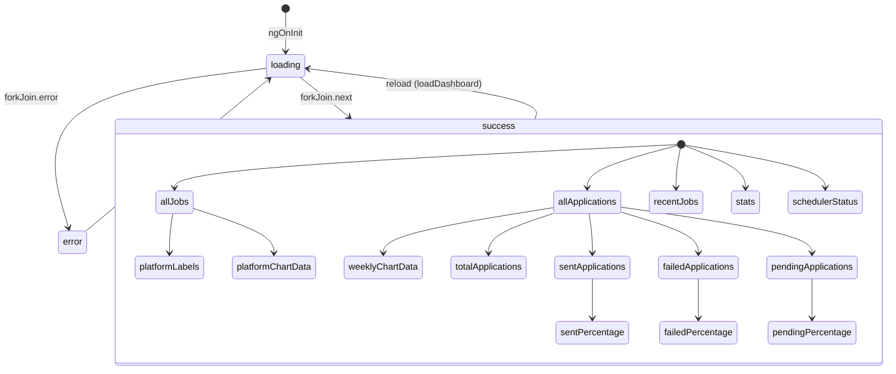

# Dashboard Module Documentation

## Visão Geral

O módulo **Dashboard** (`DashboardComponent`) é a tela principal do JobHunter. Exibe métricas agregadas de vagas e candidaturas, status do agendador (scheduler), gráficos de distribuição por plataforma e frequência semanal, além das 5 vagas mais recentes.

**Seletor:** `app-dashboard`  
**Rota:** `/` (página inicial)  
**Standalone:** Sim

---

## Dependências

### Angular Core
- `@angular/core`: `Component`, `inject`, `OnInit`, `signal`, `computed`, `DestroyRef`
- `@angular/router`: `RouterLink`
- `@angular/core/rxjs-interop`: `takeUntilDestroyed`

### RxJS
- `forkJoin`: Requisições paralelas
- Operators: `pipe`

### Serviços (Core)
| Serviço | Responsabilidade |
|---------|------------------|
| `JobsService` | Busca de vagas (`getJobs`) |
| `ApplicationsService` | Busca de candidaturas (`getApplications`) |
| `SchedulerService` | Status e controle do agendador (`getStatus`, `pause`, `resume`, `triggerJob`) |
| `ToastService` | Feedback visual (sucesso/erro) |

### Componentes Compartilhados
| Componente | Uso |
|------------|-----|
| `StatCardComponent` | Cards de estatísticas (3 no topo) |
| `ChartBarComponent` | Gráficos de barras (2) |
| `ScoreBadgeComponent` | Badge de score nas vagas recentes |
| `TriangleAlertIconComponent` | Ícone de erro no estado de falha |
| `RelativeTimePipe` | Formatação relativa de datas |
| `SendIconComponent` | Ícone no botão "Buscar Vagas" |
| `GslPageHelp` | Botão de ajuda contextual (manual `dashboard.md`) |

### Models
- `Job` (core/models/job.model.ts)
- `Application` (core/models/application.model.ts)

### Chart Library
- `ng2-charts` com `provideCharts(withDefaultRegisterables())`

---

## Arquitetura e Fluxo

```mermaid
flowchart TD
    A[ngOnInit] --> B[loadDashboard]
    B --> C[loading = true]
    C --> D[forkJoin: 3 requests paralelas]
    D --> E[jobsService.getJobs(200)]
    D --> F[applicationsService.getApplications(500)]
    D --> G[schedulerService.getStatus]
    E --> H[next: jobs + applications]
    F --> H
    G --> H
    H --> I[Atualiza signals: stats, allJobs, recentJobs, allApplications]
    I --> J[loading = false]
    H -.-> K[error: set error message + toast.error]
    K --> J
    
    L[User Actions] --> M[toggleScheduler]
    L --> N[triggerScan]
    M --> O[schedulerService.pause/resume]
    N --> P[schedulerService.triggerJob('scan_jobs')]
    O --> Q[takeUntilDestroyed + subscribe]
    P --> Q
    Q --> R[toast.success/error]
    Q --> S[togglingScheduler = false]
```

### Ciclo de Vida dos Signals



---

## Exemplo de Uso

### Navegação
```html
<!-- No app.html (root) -->
<router-outlet />
```
A rota `/` carrega `DashboardComponent` automaticamente.

### Trigger Manual (ex: botão externo)
```typescript
// Em outro componente
constructor(private dashboard: DashboardComponent) {}

forcarAtualizacao() {
  this.dashboard.loadDashboard();
}
```

---

## Regras de Negócio

### 1. Agregação de Vagas por Plataforma
- Extrai `job.platform`, normaliza (trim + capitalização)
- Agrupa e ordena por contagem decrescente
- Top 4 plataformas + "Outras" (se > 5)
- Fallback: `['Nenhuma']` se array vazio

### 2. Candidaturas por Semana (Últimos 7 dias)
- Gera labels: `['Seg', 'Ter', 'Qua', 'Qui', 'Sex', 'Sáb', 'Dom']` (locale `pt-BR`)
- Compara `application.sentAt` (ISO string) com data local (YYYY-MM-DD)
- **Importante:** Usa `Date` local (não UTC) para evitar deslocamento de fuso

### 3. Percentuais do Resumo
- Base: `totalApplications = allApplications.length`
- `sentPercentage = round(sent / total * 100)`
- `failedPercentage = round(failed / total * 100)`
- `pendingPercentage = round(pending / total * 100)`
- Retorna `0` se `total === 0`

### 4. Scheduler Controls
| Ação | Condição | Servicio |
|------|----------|----------|
| Pausar | `isRunning === true` | `schedulerService.pause()` |
| Ativar | `isRunning === false` | `schedulerService.resume()` |
| Buscar Vagas | `isRunning === true` | `schedulerService.triggerJob('scan_jobs')` |
| Buscar Vagas | `isRunning === false` | **Desabilitado** (botão `disabled`) |

### 5. Limpeza de Subscriptions
- Todos `subscribe()` usam `.pipe(takeUntilDestroyed(destroyRef))`
- Evita memory leaks ao navegar para fora do dashboard

---

## Performance

### Computed Signals (Derivados)
| Signal | Dependências | Recalcula quando |
|--------|--------------|------------------|
| `platformLabels` | `allJobs` | Nova lista de vagas |
| `platformChartData` | `allJobs`, `platformLabels` | Nova lista de vagas |
| `weeklyLabels` | (nenhuma - estático) | Nunca |
| `weeklyChartData` | `allApplications` | Nova lista de candidaturas |
| `totalApplications` | `allApplications` | Nova lista |
| `sentApplications` | `allApplications` | Nova lista |
| `failedApplications` | `allApplications` | Nova lista |
| `pendingApplications` | `allApplications` | Nova lista |
| `sentPercentage` | `totalApplications`, `sentApplications` | Mudança nos acima |
| `failedPercentage` | `totalApplications`, `failedApplications` | Mudança nos acima |
| `pendingPercentage` | `totalApplications`, `pendingApplications` | Mudança nos acima |

### Otimizações
- `forkJoin`: 3 requests paralelas (não sequenciais)
- `perPage: 200` jobs + `per_page: 500` applications - evita paginação no front
- `takeUntilDestroyed`: Cleanup automático
- `signal` + `computed`: Fine-grained reactivity (sem zone.js overhead)

---

## Troubleshooting

| Sintoma | Causa Provável | Solução |
|---------|----------------|---------|
| Gráficos vazios | `allJobs` ou `allApplications` vazio | Verificar se API retorna dados; checar `loading`/`error` |
| Percentuais NaN | `totalApplications === 0` | Código já trata (retorna 0) |
| Scheduler não atualiza | `schedulerStatus` é signal do service | Verificar `SchedulerService.status` signal |
| Erro CORS no load | Backend sem CORS | Configurar CORS no FastAPI |
| "Could not resolve" build | Cache Angular stale | `rm -rf dist/ .angular/` e rebuild |
| Botão "Buscar Vagas" desabilitado | `schedulerStatus().isRunning === false` | Ativar automação primeiro |

---

## Extensibilidade

### Adicionar Novo Gráfico
1. Criar `computed` derivado de `allJobs` ou `allApplications`
2. Adicionar `<app-chart-bar>` no template
3. Incluir no grid `md:grid-cols-3` se necessário

### Novo Filtro de Período (ex: 30 dias)
```typescript
// Adicionar signal de período
period = signal<'7d' | '30d'>('7d');

// weeklyLabels/weeklyChartData usam this.period()
weeklyLabels = computed(() => {
  const days = this.period() === '7d' ? 6 : 29;
  // ...
});
```

### Exportar Dados (CSV/PDF)
```typescript
exportDashboard(): void {
  const data = {
    stats: this.stats(),
    platform: this.platformChartData(),
    weekly: this.weeklyChartData(),
    applications: this.allApplications(),
  };
  // Gerar CSV/PDF
}
```

---

## Arquivos Relacionados

| Arquivo | Tipo |
|---------|------|
| `src/app/features/dashboard/dashboard.component.ts` | Componente principal |
| `src/app/features/dashboard/dashboard.component.spec.ts` | Testes (se existir) |
| `src/app/core/services/jobs.service.ts` | Service de vagas |
| `src/app/core/services/applications.service.ts` | Service de candidaturas |
| `src/app/core/services/scheduler.service.ts` | Service do agendador |
| `src/app/shared/services/toast.service.ts` | Toast unificado |
| `src/app/shared/components/chart-bar/chart-bar.component.ts` | Gráfico de barras |
| `src/app/shared/components/stat-card/stat-card.component.ts` | Card de estatística |
| `src/app/shared/components/score-badge/score-badge.component.ts` | Badge de score |
| `src/app/shared/pipes/relative-time.pipe.ts` | Pipe tempo relativo |
| `src/app/core/models/job.model.ts` | Model Job |
| `src/app/core/models/application.model.ts` | Model Application |