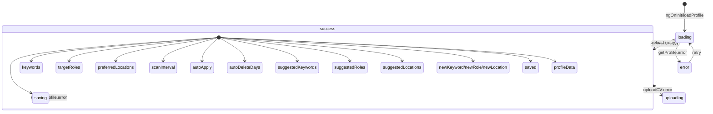

# Profile Module Documentation

## Visão Geral

O módulo **Profile** (`ProfileComponent`) é a tela unificada de configurações do JobHunter. Consolida dados pessoais, upload de currículo (dual mode), tags dinâmicas com sugestões baseadas em CV/API, seleção de tema (4 temas), configurações de automação e salvamento unificado em uma única página.

**Seletor:** `app-profile`  
**Rota:** `/profile`  
**Standalone:** Sim

---

## Dependências

### Angular Core
- `@angular/core`: `Component`, `inject`, `OnInit`, `signal`, `ViewChild`, `DestroyRef`
- `@angular/forms`: `FormsModule` (ngModel two-way binding)
- `@angular/core/rxjs-interop`: `takeUntilDestroyed`

### PrimeNG
- `primeng/fileupload`: `FileUploadModule`, `FileUpload` (modo `advanced` + `customUpload`)

### Serviços (Core)
| Serviço | Responsabilidade |
|---------|------------------|
| `ProfileService` | CRUD perfil (`getProfile`, `updateProfile`, `uploadCV`, `getCVSuggestions`) |
| `ThemeService` | Temas (4: dark, light, capycro, high-contrast) via signals |
| `ToastService` | Feedback visual unificado |

### Models
- `CandidateProfile` + `CandidateProfileUpdate` (core/models/profile.model.ts)

### Componentes Compartilhados
| Componente | Uso |
|------------|-----|
| `UserIconComponent` | Ícone seção Dados Pessoais |
| `FileTextIconComponent` | Ícone seção Currículo |
| `CircleCheckIconComponent` | Check visual CV carregado |
| `CloudUploadIconComponent` | (não usado — fallback SVG) |
| `TriangleAlertIconComponent` | Erro estado vazio |
| `CheckIconComponent` | Feedback "Tudo salvo" |
| `TagIconComponent` | Ícone seção Palavras-chave |
| `BriefcaseIconComponent` | Ícone seção Cargos alvo |
| `MapPinIconComponent` | Ícone seção Localizações |
| `CogIconComponent` | Ícone seção Automação |
| `GslPageHelp` | Botão ajuda contextual (`perfil.md`) |

---

## Architecture & Data Flow

```mermaid
flowchart TD
    A[ngOnInit] --> B[loadProfile]
    B --> C[loading = true]
    C --> D[profileService.getProfile]
    D --> E[next: profile]
    E --> F[profileData.set + keywords/targetRoles/preferredLocations/scanInterval/autoApply/autoDeleteDays]
    F --> G[loading = false]
    F --> H[loadSuggestions]
    H --> I[profileService.getCVSuggestions]
    I --> J[next: suggestions]
    J --> K[suggestedKeywords/roles/locations.set]
    D -.-> L[error: error.set + toast.error]
    L --> G
    
    M[User Actions] --> N[updateField → profileData.update + saved=false]
    M --> O[Tag mgmt: add/remove keywords/roles/locations]
    M --> P[Theme: themeService.setTheme]
    M --> Q[Settings: scanInterval/autoApply/autoDeleteDays signals]
    M --> R[saveAll → profileService.updateProfile]
    M --> S[onFileUpload → profileService.uploadCV]
    R --> T[next: saving=false + saved=true + toast.success + loadSuggestions]
    R -.-> U[error: saving=false + toast.error]
    S --> V[next: profileData.update(cvFilename) + toast.success + loadSuggestions]
    S -.-> W[error: toast.error]
```

### Signal Lifecycle (ProfileComponent)



---

## Business Rules

### 1. Dual Mode CV Upload (PrimeNG FileUpload)
- **Sem CV:** `mode="advanced"` zona de drag-drop (`cvUploadZone`) com template `#empty` customizado
- **Com CV:** `mode="advanced"` compacto (`cvUploadCompact`) — apenas botão "Substituir CV" + filename + check visual
- Ambos: `customUpload=true`, `showUploadButton=false`, `showCancelButton=false`, `accept=".pdf"`, `maxFileSize=10MB`
- Upload via `customUpload` → `onSelect` → `profileService.uploadCV(file)` (multipart/form-data)
- Sucesso: atualiza `profileData.cvFilename`, limpa ambos uploads, recarrega sugestões

### 2. Dynamic Tag Suggestions (CV/API driven)
- Iniciais: arrays hardcoded de fallback (12 keywords, 6 roles, 6 locations)
- `loadSuggestions()` chamado após `loadProfile()` sucesso E após `uploadCV()` sucesso
- `ProfileService.getCVSuggestions()` → endpoint `/profile/cv-suggestions` (processa CV no backend)
- Fallback silencioso: erro não quebra UI, mantém sugestões padrão
- Template: botões "+ {{ suggest }}" só aparecem se **não** já estiver na lista ativa

### 3. Tag Management (Keywords, Roles, Locations)
- Signals independentes: `keywords`, `targetRoles`, `preferredLocations` (string[])
- Input controlado: `newKeyword`/`newRole`/`newLocation` signals + Enter key + botão "+"
- Validação: `trim()`, duplicata check via `.includes()`, update imutável via `.update()`
- Remoção: botão ✕ inline → `.update(k => k.filter(x => x !== kw))`
- Persistência: apenas no `saveAll()` (payload inclui arrays completos)

### 4. Theme Selection (4 Themes)
- `ThemeService.themes`: array fixo `[{id:'dark',label:'Escuro',icon:'🌙'},{id:'light',label:'Claro',icon:'☀️'},{id:'capycro',label:'Capycro',icon:'🦫'},{id:'high-contrast',label:'Alto Contraste',icon:'⚫⚪'}]`
- `getThemeSwatch(themeId)`: retorna 4 cores hex (bg, surface, primary, accent) para preview card
- Click card → `themeService.setTheme(id)` → persiste no service + localStorage + aplica CSS vars globais
- Card ativo: border-primary + badge "Ativo" com check verde na cor do tema

### 5. Automation Settings
| Setting | Tipo | Range/Opções | Default |
|---------|------|--------------|---------|
| `scanInterval` | select | 3h, 6h, 12h, 24h | 6h |
| `autoDeleteDays` | number | 0-365 (0=desativado) | 30 |
| `autoApply` | toggle checkbox | true/false | false |

- Toggle custom: peer checkbox + styled slider (CSS only, sem biblioteca)
- `autoApply` → envia CV para vagas com `score >= 80%` (regra de negócio backend)

### 6. Unified Save (`saveAll()`)
- Agrega **todos** campos em único payload `CandidateProfileUpdate`
- `profileData` (6 campos) + 3 arrays tags + 3 settings automação
- `saving` signal → desabilita botão + "Salvando..."
- Sucesso: `saved=true` + toast + auto-hide 3s + `loadSuggestions()` (refresh sugestões pós-CV)
- Erro: `saving=false` + toast.error

### 6. Help Contextual
- `GslPageHelp` com `document="perfil.md"` carrega manual específico da tela

---

## Performance

### Computed Signals (Derivados)
| Signal | Dependências | Recalcula quando |
|--------|--------------|------------------|
| `hasActiveFilters` | (N/A — não usado no Profile) | — |

### Signals Diretos (Set/Update)
| Signal | Atualizado por | Frequência |
|--------|----------------|------------|
| `profileData` | `loadProfile`, `updateField`, `uploadCV` | Baixa (user action) |
| `keywords/targetRoles/preferredLocations` | Tag mgmt methods, `loadProfile` | Média (user action) |
| `suggestedKeywords/roles/locations` | `loadSuggestions` (API) | Baixa (load + post-upload) |
| `scanInterval/autoApply/autoDeleteDays` | User input (select/number/toggle) | Baixa |
| `loading/saving/saved/error` | Lifecycle methods | Transiente |
| `newKeyword/newRole/newLocation` | Input keystrokes | Alta (digitação) |

### Otimizações
- **takeUntilDestroyed**: Cleanup automático em todas subscriptions (`getProfile`, `getCVSuggestions`, `updateProfile`, `uploadCV`)
- **Signal granularity**: Cada tag array é signal independente — adicionar keyword não re-renderiza roles/locations
- **Immutable updates**: `.update(k => [...k, new])` garante change detection correto
- **Debounce ausente** em tags: intencional (ações discretas, não digitação contínua)
- **localStorage sync**: Via `ThemeService` (centralizado), não no componente

---

## Troubleshooting

| Sintoma | Causa Provável | Solução |
|---------|----------------|---------|
| Perfil não carrega | API 401/500 | Verificar `loading`/`error`; checar backend logs; token expirado? |
| CV não faz upload | Arquivo > 10MB ou não-PDF | Validar `accept=".pdf"` + `maxFileSize=10485760`; checar multipart no backend |
| Sugestões não atualizam | `getCVSuggestions` falhou silencioso | Logs backend; endpoint processa PDF? Fallback mantém hardcoded |
| Tema não persiste | `ThemeService` não salvou | Verificar `ThemeService.setTheme` → localStorage + CSS vars |
| Tags não salvam | `saveAll` não incluiu arrays | Confirmar `keywords()`, `targetRoles()`, `preferredLocations()` no payload |
| "Salvando..." travado | `updateProfile` não resolve | Network tab; backend timeout; `takeUntilDestroyed` não cancelou? |
| Checkbox autoApply não visual | CSS peer checkbox broken | Verificar `:peer-checked:bg-primary` + `peer-checked:translate-x-5` |
| Grid 3 colunas quebra mobile | `lg:col-span-3` sem `md:` | Adicionar `md:grid-cols-1` ou `md:col-span-1` nos cards config |

---

## Extensibilidade

### Adicionar Novo Campo no Perfil
```typescript
// 1. Model: CandidateProfile / CandidateProfileUpdate
// 2. profileData signal já aceita Partial<CandidateProfile>
// 3. Template: adicionar input no grid Dados Pessoais
// 4. updateField(field, value) já genérico — funciona automaticamente
// 5. saveAll: payload espalha profileData() — pega campo novo
```

### Nova Categoria de Tags (ex: "Benefícios Desejados")
```typescript
// 1. Novo signal: desiredBenefits = signal<string[]>([])
// 2. Novo input: newBenefit = signal('')
// 3. Métodos: addBenefit(), removeBenefit(), addSuggestedBenefit()
// 4. Template: card igual Keywords/Roles/Locations (copy-paste adaptado)
// 5. saveAll: incluir desiredBenefits: this.desiredBenefits() no payload
// 6. Backend: adicionar campo no model CandidateProfile
```

### Sugestões Baseadas em IA (OpenAI/Local LLM)
```typescript
// 1. ProfileService.getCVSuggestions() já existe
// 2. Backend: processar PDF → extrair skills → chamar LLM → retornar structured JSON
// 3. Frontend: loadSuggestions() já chama e seta signals — zero mudança
// 4. Loading state: adicionar suggestedLoading = signal(false) se necessário
```

### Exportar/Importar Perfil (JSON)
```typescript
exportProfile(): void {
  const data = {
    profile: this.profileData(),
    keywords: this.keywords(),
    targetRoles: this.targetRoles(),
    preferredLocations: this.preferredLocations(),
    settings: {
      scanInterval: this.scanInterval(),
      autoApply: this.autoApply(),
      autoDeleteDays: this.autoDeleteDays(),
    },
  };
  downloadBlob(JSON.stringify(data, null, 2), 'profile-backup.json');
}

importProfile(json: string): void {
  const data = JSON.parse(json);
  this.profileData.set(data.profile);
  this.keywords.set(data.keywords);
  this.targetRoles.set(data.targetRoles);
  this.preferredLocations.set(data.preferredLocations);
  this.scanInterval.set(data.settings.scanInterval);
  this.autoApply.set(data.settings.autoApply);
  this.autoDeleteDays.set(data.settings.autoDeleteDays);
  this.saved.set(false);
}
```

### Validação de Formulário (Reactive Forms)
```typescript
// Migrar de FormsModule (ngModel) para ReactiveFormsModule
// FormGroup com Validators.required, Validators.email, etc.
// Exibir erros inline via *ngIf="form.get('email').invalid && form.get('email').touched"
// saveAll() só habilitado se form.valid
```

---

## Related Files

| Arquivo | Tipo |
|---------|------|
| `src/app/features/profile/profile.component.ts` | Componente principal (808 linhas) |
| `src/app/features/profile/profile.component.spec.ts` | Testes (se existir) |
| `src/app/core/services/profile.service.ts` | Service perfil + CV + sugestões |
| `src/app/core/services/theme.service.ts` | Service temas (4 temas + signals) |
| `src/app/core/models/profile.model.ts` | Models CandidateProfile/Update |
| `src/app/shared/services/toast.service.ts` | Toast unificado |
| `src/app/shared/components/gsl-page-help/gsl-page-help.component.ts` | Botão ajuda contextual |
| `src/app/shared/components/user-icon/user-icon.component.ts` | Ícone usuário |
| `src/app/shared/components/file-text-icon/file-text-icon.component.ts` | Ícone arquivo |
| `src/app/shared/components/circle-check-icon/circle-check-icon.component.ts` | Check circle |
| `src/app/shared/components/tag-icon/tag-icon.component.ts` | Tag icon |
| `src/app/shared/components/briefcase-icon/briefcase-icon.component.ts` | Briefcase icon |
| `src/app/shared/components/map-pin-icon/map-pin-icon.component.ts` | Map pin icon |
| `src/app/shared/components/cog-icon/cog-icon.component.ts` | Cog icon |
| `src/app/shared/components/check-icon/check-icon.component.ts` | Check icon |
| `src/app/shared/components/triangle-alert-icon/triangle-alert-icon.component.ts` | Alert icon |